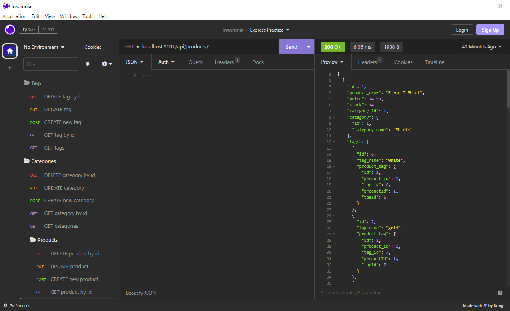

# E-Commerce-Backend

## Description
With this E-Commerce application, the backend routes are set up for the user to create, read, update, and delete tags, categories, and products from a database of shop information. This empowers the user's business by providing access to control the content on their E-Commerce site. They can use the GET method to read all existing tags, categories, or products, as well as to see a single tag, category, or product through its ID query. The user can also use the POST method to create a new tag, category, and/or product. Additionally, the user can use the PUT method to update any tag, category, or product by its ID. Finally, the user can delete any tag, category, or product by its ID. 

This application uses the MySql2 and Sequelize packages to connect the Express.js API to our MYSQL database of preset E-Commerce information. It also uses the dotenv package to use environment variables to store my sensitive data such as MySQL username, password, and database name.

## Credit
Thank you to my classmates; Lucas Wysoczanski, Daniel Lee, May Pham, and Joey Lee; for partnering with me to work on this challenge. Here are their GitHub profiles-- Lucas Wysoczanski: https://github.com/LucasWyski001 Daniel Lee: https://github.com/drog41813 May Pham: https://github.com/mayphamx Joey Lee: https://github.com/Rockojoe2

## License
This repository is licensed by MIT. See https://mit-license.org/ to learn more.

## Usage
Watch this walkthrough video: https://drive.google.com/file/d/1q_7vQaxBTdQzsV1jHRgYSe_E552phiUm/view?usp=sharing

